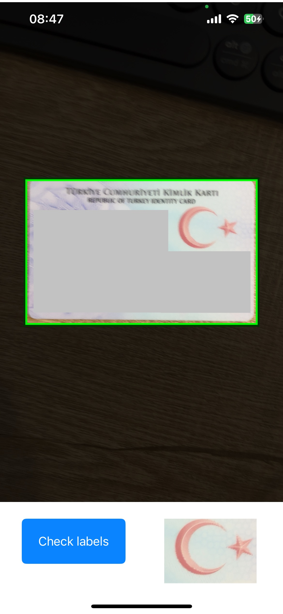

# PapilonIDRecognitioniOS

[](https://cocoapods.org/)

PapilonIDRecognitioniOS-SDK is a robust SDK that offers ID recognition features for various countries' ID cards, passports, and driving licenses.

## Getting Started

To run the example project, clone the repo, and run `pod install` in the IDRecognitionDemo directory first.

### Prerequisites

- iOS 13+

### Installation

This SDK is available through CocoaPods. Add the following line to your Podfile:

```ruby
pod 'PapilonIDRecognitioniOS-SDK'
```

Then, run the following command:

```ruby
pod install
```

## Setup PapilonIDRecognitioniOS-SDK

For the SDK to function, you require a license token. Reach out to Papilon Savunma or drop an email at yasinkoker@papilon.com.tr for the same.

Note: Ensure the safekeeping of your token as it's unique to you. In case of any discrepancies, contact Papilon Savunma with the provided licenceID.

## Usage

#### 1. Podfile Configuration

Ensure your Podfile resembles the following:

```ruby
use_frameworks!

platform :ios, '13.0'

target 'IDRecognitionDemo' do
  pod 'PapilonIDRecognitioniOS-SDK'
end

post_install do |installer|
  installer.pods_project.targets.each do |target|
    target.build_configurations.each do |config|
      config.build_settings['BUILD_LIBRARY_FOR_DISTRIBUTION'] = 'YES'
      config.build_settings['IPHONEOS_DEPLOYMENT_TARGET'] = '13.0'
    end
  end
end
```

#### 2. Camera Permission

Ensure that your application has permission to access the camera. Update your info.plist accordingly.

    <!-- Camera Usage Description -->
    <key>NSCameraUsageDescription</key>
    <string>This app requires camera access to perform id recognition.</string>

#### 3. SDK Initialization

First, import PapilonIDRecognitioniOS in your ViewController:
```swift
import UIKit
import AVFoundation
import PapilonIDRecognitioniOS
```

Then, initialize and configure the CameraManager:
```swift
class ViewController: UIViewController, CameraManagerDelegate {
    var cameraManager: CameraManager?
    
    @IBOutlet weak var previewView: UIView!
    
    override func viewDidLoad() {
        super.viewDidLoad()
        
        cameraManager = CameraManager()
        cameraManager?.delegateCameraManager = self
        cameraManager?.configureCameraManager(
          idType: "<id_type>", 
          token: "<your_token>", 
          licenseID: "<license_id>", 
          in: previewView)
    }
}
```

Implement CameraManagerDelegate methods to handle captured images, distance evaluation, and ID document detection:
```swift
extension ViewController {
    
    func didCaptureImages(_ images: [IDRecognizer.ImageResult]) {
        // Handle captured images
    }
    
    func didEvaluateDistance(evaluation: IDRecognizer.DistanceEvaluation) {
        // Handle distance evaluation
    }
    
    func didDetectIDDocument(results: [String : Any]) {
        // Handle ID document detection
    }
    
    func didUpdateMarkerImage(_ image: UIImage) {
        // Handle marker image updates
    }
}
```

## Example: a Complete ViewController
```swift
import UIKit
import AVFoundation
import PapilonIDRecognitioniOS

class ViewController: UIViewController, CameraManagerDelegate {
    var cameraManager: CameraManager?
    
    @IBOutlet weak var previewView: UIView!
    @IBOutlet weak var capturedImageView: UIImageView!
    @IBOutlet weak var checkLabelsBtn: UIButton!
    
    var distanceLabel: UILabel!

    override func viewDidLoad() {
        super.viewDidLoad()
        
        cameraManager = CameraManager()
        cameraManager?.delegateCameraManager = self
        cameraManager?.configureCameraManager(
            idType: "<id_type>", // for example 792_id_front for Turkish ID Card as seen in the example ui below.
            token: "<your_token>",
            licenseID: "<license_id>",
            in: previewView
        )
                
        distanceLabel = UILabel()
        distanceLabel.frame = CGRect(x: 20, y: previewView.frame.maxY + 20, width: view.frame.width - 40, height: 40)
        distanceLabel.backgroundColor = .lightGray
        distanceLabel.textColor = .white
        distanceLabel.textAlignment = .center
        distanceLabel.text = "" 
        view.addSubview(distanceLabel)
        view.bringSubview(toFront: distanceLabel)
        distanceLabel.isHidden = true
    }
    
    // Handle check labels button
    @IBAction func didTakePhoto(_ sender: UIButton) {
        cameraManager?.requestCapturedImages()
    }

    
    //MARK: CameraManagerDelegate methods...
    func didCaptureImages(_ images: [IDRecognizer.ImageResult]) {
        // When this method is called, open the CapturedImagesViewController and pass it the image results.
        let capturedImagesVC = CapturedImagesViewController(images: images)
        self.present(capturedImagesVC, animated: true, completion: nil)
    }
    
    func didUpdateMarkerImage(_ image: UIImage) {
        // Actions to be taken when the marker image is updated
        DispatchQueue.main.async {
            self.capturedImageView.image = image
        }
    }
    
    func didDetectIDDocument(results: [String : Any]) {
        if let keyName = results["name"] as? String {
            print(keyName)
        } else {
            print("Not found in results dictionary")
        }
    }
    
    func didEvaluateDistance(evaluation: IDRecognizer.DistanceEvaluation) {
        DispatchQueue.main.async {
            switch evaluation {
            case .tooFar, .tooClose:
                self.distanceLabel.text = "Keep document in the frame"
                self.distanceLabel.isHidden = false // show uilabel
            case .perfect:
                // if "perfect" then hide uilabel
                self.distanceLabel.isHidden = true
            }
        }
    }

}
```
## Example: ViewController UI
<div style="text-align:center">
    
</div>